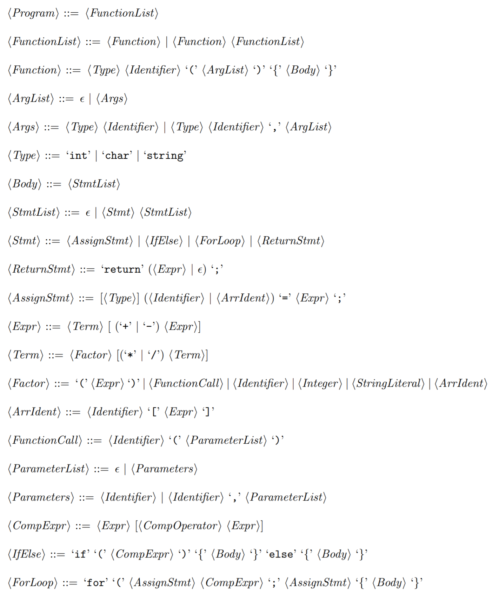

# Runi
Runi is a context-free grammar, lexer and predictive recursive descent parser for a C-like language in Go.

## Motivation
This implementation is a part of our laboratory project to implement lexical and syntax analyzers at BITS Pilani. We also wanted to go out of our comfort zone and choose a modern language that we had not tried before.

## EBNF Grammar

## Dependencies

- [gographviz](https://github.com/awalterschulze/gographviz), to generate the DOT specification
- [Graphviz](https://www.graphviz.org/), to generate the image from the DOT specification

## Usage

Please run `$ go run . [file]` where `[file]` represents an optional argument (which defaults to `test.txt`) to parse the file. If the parser accepts the program, it will generate a DOT specification of the parse tree depicting the leftmost derivation in `out.dot`. This specification can be run through Graphviz to generate the parse tree. We recommend doing `$ dot -Tpng -Gdpi=300 out.dot -o out.png`. 

## Lexer Testing
Input files for our lexer's test suite can be found in `src/tests/`. Please do `go test` to run the tests.

## Visualizations

Here are some sample generated visualizations from `images/`. The program source is shown at the top of the image.

## Authors
Rupanshu Soi & Nipun Wahi, Department of Computer Science, BITS Pilani - Hyderabad Campus, India.

## Why "Runi" ?
`"Rupanshu Soi"[:2] + "Nipun Wahi"[:2]`

## References
- [Writing An Interpreter in Go by Thorsten Ball](https://interpreterbook.com/)
